# Start Your Journey With UX - Course Notes

Course: [Start Your Journey With UX](https://instructory.net/courses/start-your-journey-with-ux) (Instructory)
Instructor: Rifat M Huq (UX researcher and UI designer, built Instructory itself)
Length: 21h 54m, 90 lectures, beginner level
My status: completed

## Course contents (instructor's own TOC slides)

The instructor's "Contents of this Course" slides, captured from the course videos. Full curriculum with durations is in [curriculum.md](curriculum.md).

| | |
|---|---|
| 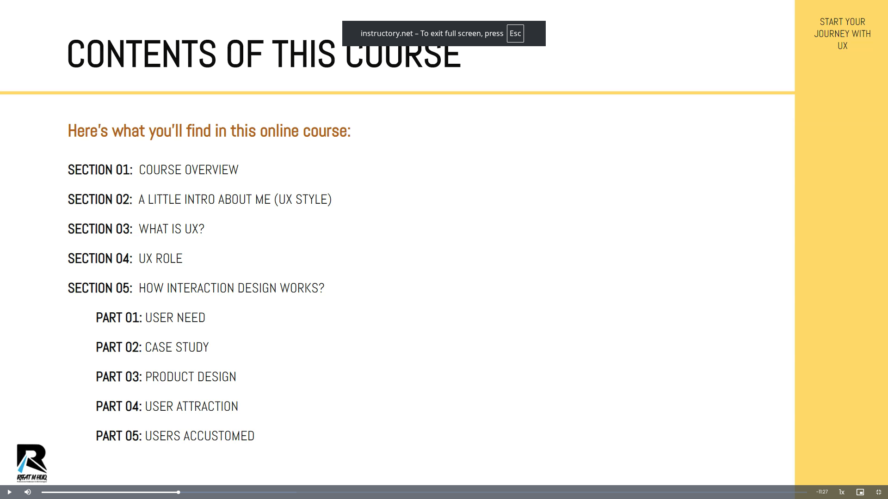 | 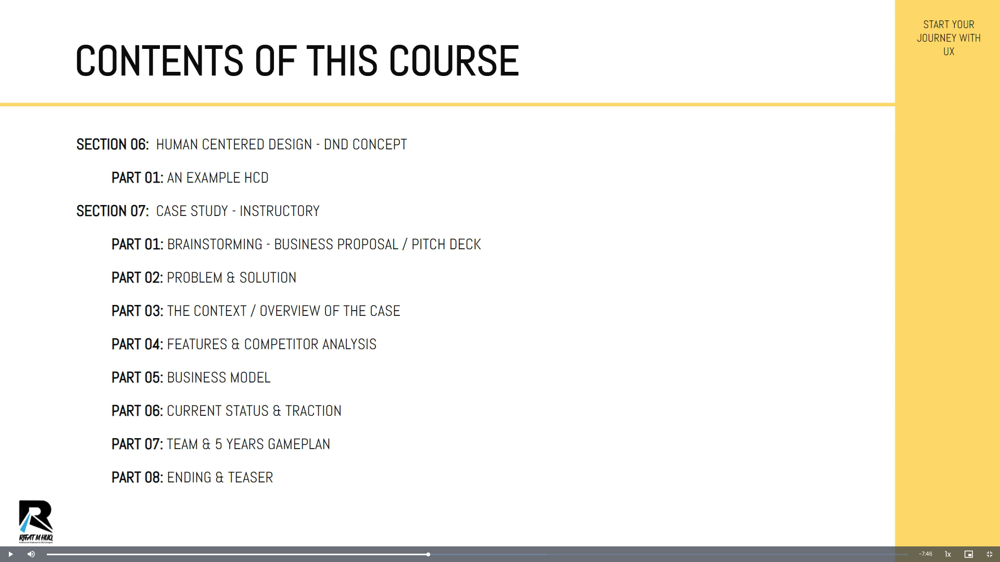 |
| 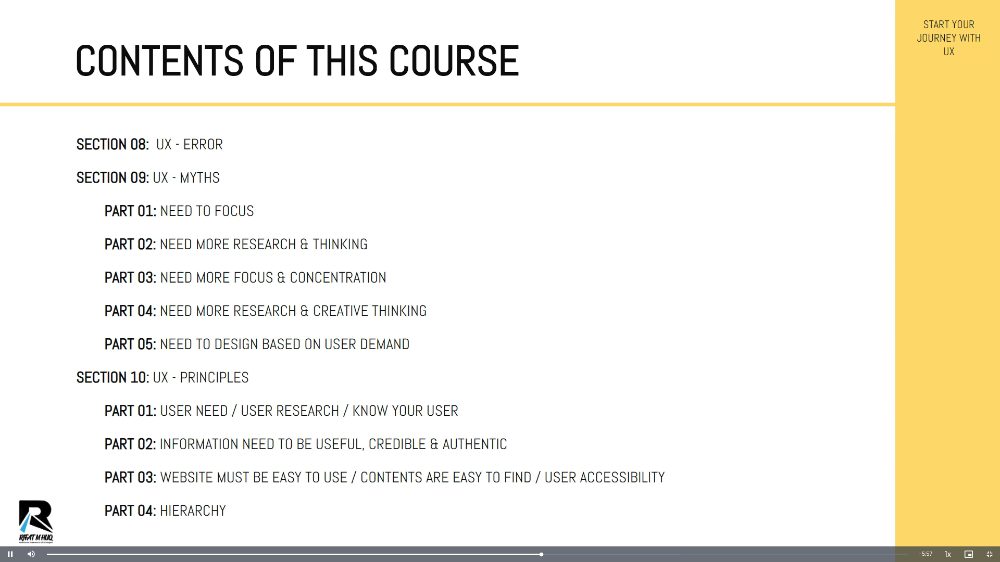 | 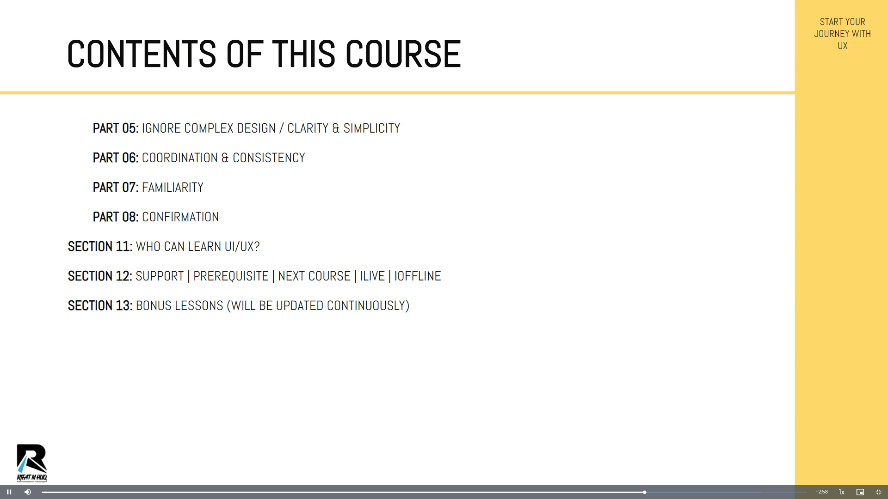 |

## How this course is organized (my mental map)

Three blocks:

1. **UX theory** (Sections 1 to 13): what UX is, roles, interaction design, human centered design, a full real case study on Instructory, common errors, myths, and core principles.
2. **UX methods and process** (Sections 14 to 23): the actual tools of the trade. KWHL, user personas, site maps, POEMS, MVP, Agile and A/B testing, usability testing, UX laws, and the different UX job roles.
3. **Hands-on with Adobe XD** (Sections 24 to 30): the tool itself plus one big freelancing project, a full multi-page website design from requirement analysis to prototype.

Below are my notes per block.

---

## Block 1: UX theory

### What is UX (Section 3)

First, the terms:

- **UX** stands for **User Experience**: the experience itself, what the user feels and goes through when using a product. Every product already has a UX, good or bad, whether anyone designed it or not.
- **UXD** stands for **User Experience Design**: the practice of shaping that experience on purpose. UX is the outcome, UXD is the work.

So "I do UX" really means "I do UXD". The distinction sounds small but it matters: you cannot directly build an experience, you can only design the conditions (interface, flow, content, speed) and the experience happens in the user's head.

A website or app is not just pages connected with links. It is an interface where the user and the product meet and affect each other. That interaction creates an experience, and UX design is the job of making that experience as good as possible.

A detail I liked: the instructor points out that even his own course slides are made with alignment and hierarchy in mind. He practices the principles while teaching them, the slides themselves are a design lesson.

**His advice on learning design: do not start from zero.** See many designs, hundreds of them. See, copy, and understand existing good work first, then you become a pro. Nobody invents design taste from nothing, it is trained by exposure. (Same as how developers learn by reading other people's code before writing their own.)

#### UI vs UX

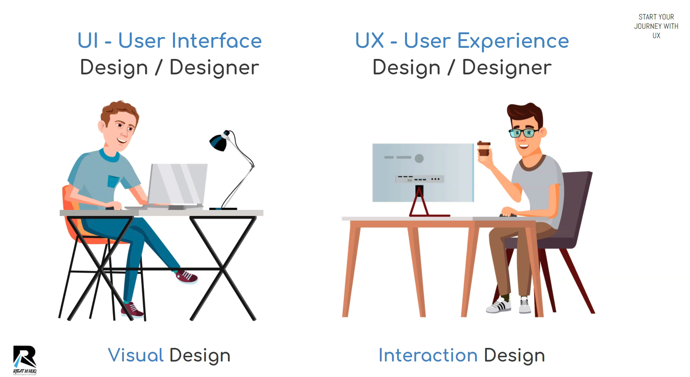

- **UI, User Interface Design** = **Visual Design**. What the user sees and touches: layout, colors, typography, buttons.
- **UX, User Experience Design** = **Interaction Design**. How the whole thing works and feels: can users find what they need, do they trust it, do they come back.

Good UI with bad UX is a pretty thing nobody can use. UX comes first, UI expresses it.

#### Choosing your path: UI or UX?

The instructor says every learner has to decide where they want to go, UI or UX, and the honest way to choose is to look at yourself first: what kind of work do you love, and what are you naturally good at? Then pick, do not just follow the market.

- **If you lean creative and visual, UI fits you.** The test is aesthetic sense. Many web developers write excellent code but are weak at design: colors, contrast, spacing just do not come to them. The instructor's example: knowing which pants go with a white shirt. That instinct for what pairs well, and being able to express it on screen, is the UI part. It can be trained (by seeing those hundreds of designs), but you should enjoy it.
- **If you lean problem solving, UX fits you.** The test: when you get an idea, does it solve a real problem for users? UX is spotting the user's need and then executing the idea around it. His examples: I want to open an online shop, make and sell saris, start a cooking business. Executing that means taking user feedback and demand, choosing color combinations and graphics that attract the right users, deciding where to place a discount so users actually buy more. If the placement of one offer increases sales, that was a UX decision. All of it is problem solving for the user.

My own take as a frontend dev: the two are not a wall, they are a spectrum, and the same person moves along it per task. But the entry question is right: energy follows enjoyment. I lean problem-solving first (UX), and I am using courses like the Scrimba UI one to train the visual side deliberately, since that is my weaker muscle.

### A little intro about the instructor (Section 2)

Skipped for now, will watch later and add notes here.

### UX role (Sections 4 and 23)

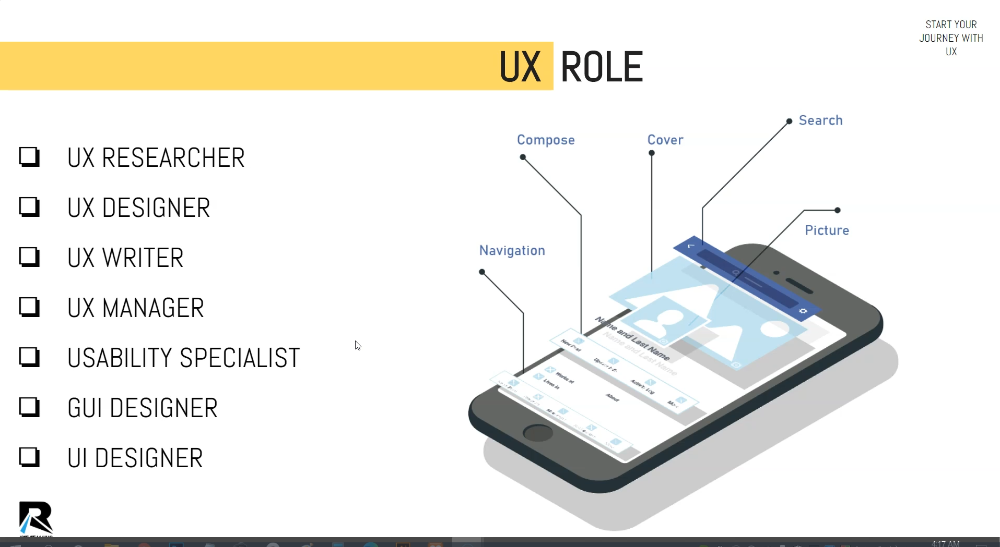

UX is not one job. The full role list from the Section 4 opening slide:

1. UX Researcher
2. UX Designer
3. UX Writer
4. UX Manager
5. Usability Specialist
6. GUI Designer
7. UI Designer

The slide's phone mockup makes the point visually: one Facebook-style profile screen, and every labeled part (navigation, compose, cover, search, picture) is territory where several of these roles worked together.

The main ones the course goes deep on:

- **UX Researcher**: the understanding role. Their job is to research and understand everything before anyone designs: what will actually be sellable in the market, and the full requirements gathered from all sides (users, client, business, competitors). Talks to users, runs interviews and surveys, finds the real problems. One part I found important: the researcher also has to tell the client what is right. Clients do not understand everything about their own users or the market, they know their business but not UX. So the researcher is not an order-taker, they push back with evidence when the client's ask would hurt the product. (This is consulting posture: the research gives you the standing to say "the data shows your users need X, not Y".)
- **UX Designer**: the researcher hands over their findings, and the UX designer turns them into wireframes. The core thinking work: what functionality does the app actually need to run, and what goes where on each screen. Both are decided deliberately, thought through against the research, not by feel. The wireframe also sets sizes: how big each element is and where it sits, for everything on the screen. Important line from the instructor: do not directly copy-paste what others did. Studying many designs (Section 3 advice) is for understanding patterns, but your structure has to come from your users' needs, because a layout that works for another product's users may be wrong for yours. Reference, understand, then design your own. (Related: Nielsen Norman Group defines a wireframe as a low-fidelity skeleton of a page that shows structure and content placement before any visual design, exactly this "what goes where" stage. Source: nngroup.com/articles/wireflows/)
- **UX Writer**: the writing side. The words in the interface, and also content like blogs that attract users to the product in the first place. Microcopy matters more than I expected, button labels and error messages are part of the experience.
- **UX Manager**: owns getting the product to market. Hires however many team members the project needs, collects progress and updates from everyone, and manages the whole flow so the pieces land together. At the end the manager pulls all the reports together into one and reports up to the CEO or senior leadership. Reporting is a real duty with real accountability: if the report is late, the blame lands on the manager, nobody else.
- **Usability Specialist**: the verification role. Runs A/B testing on everything: how users are taking the product, how they are getting attracted, and the hard question, why would a user use this app at all instead of alternatives. Opens polls and asks users directly. The instructor's example stuck with me: you installed a security camera, fine, but is it actually helping? Is it mounted at the right angle? Shipping the feature is not the goal, the feature working in reality is. Same thinking for marketing surfaces: which type of poster will actually hit the target user, and does it stay consistent with the product. The specialist stays involved through the testing part and the launching part. (Related: this maps to what the industry calls usability evaluation; Nielsen's classic finding is that testing with just 5 users uncovers most usability problems. Source: nngroup.com/articles/why-you-only-need-to-test-with-5-users/)
- **UI Designer**: works out the final visual layer: which color goes where, which icon to use for what, every concrete visual choice on the screen.
- **Web Developer**: implements it. As a frontend dev this is me, and the point of the whole course for me is that developers who understand UX build better products without waiting for a designer.

The list does not stop there either. Bigger teams add more roles, communication manager and others. The instructor's advice on how to actually learn all this: you have to feel it and get down into the field. Reading role definitions teaches you the map, doing the work on a real project teaches you the job.

Along the way this team produces a chain of working outputs: research, notes, user feedback, votes and polls, sitemap, wireframe, prototype, and the MVP. Each artifact feeds the next one, and (as noted above) the manager rolls the results up into one report for the CEO or senior. The methods block (Sections 14 to 20) teaches how to actually make most of these.

In small teams (like ours) one person wears several of these hats, so knowing the boundaries helps me know which hat I have on.

### How interaction design works (Section 5)

Before starting the section, the instructor's study advice: watch regularly and revise, and be clear about what you are going to learn from each part. (Which is also exactly what these notes are for.)

#### Part 01, User Need: the telephone story

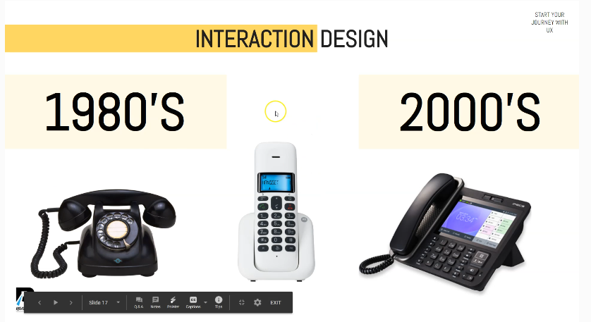

He teaches interaction design through the evolution of the telephone, 1980s dial phone to cordless to the 2000s desk phone with a screen. What the old dial phone was like to live with:

- You dial a number but you cannot see who you are calling, no confirmation on any screen.
- Someone calls you and you have no idea who it is, caller ID did not exist.
- No volume control, you could not lower the sound.
- No SIM, the line was fixed to the house, your number was not yours to carry.

And the alternative for reaching someone far away was writing letters. Funny detail from the lecture: plenty of people running love affairs through letters got caught, because a letter is a physical object anyone in the house can find. Even privacy was a missing feature.

Then each generation of phone fixed pain points of the previous one: a screen so you can see the number, caller ID so you know who is calling, volume control, SIM cards so the number belongs to the person, not the wall. Users kept adopting the modern tech because every step removed a real daily friction.

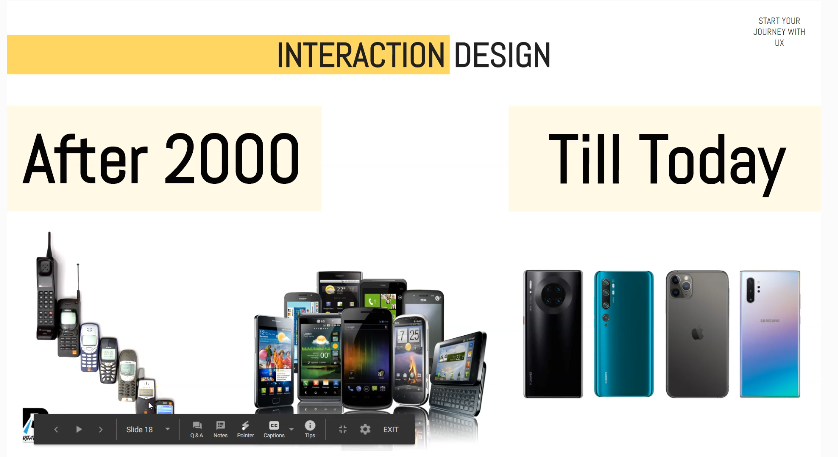

The story continues after 2000, from the Nokia-era button phones to today's full-screen smartphones. Points from this part:

- **UI is not only web or graphics.** Every kind of product has a user interface, and interaction design covers innovation in all of them. A phone's buttons, a camera, a door handle, all UI.
- **Buttons to touchscreen.** The whole computer was brought into the mobile. It became user friendly and it is always in your hand, which is why everyone uses one now. Availability itself is a UX feature: the best computer is the one within reach.
- **Why Nokia failed:** they owned the button-phone era and stayed loyal to it while the market moved to touch. My reasoning on top of the lecture: users' needs had moved (bigger screens for apps, web, video, typing), and Nokia kept optimizing yesterday's interaction model, plus their Symbian software could not keep up with the new app ecosystems. The company that ignores the shift in user interaction loses, no matter how big it is. (Related: Nokia held around 40 percent of the global handset market in 2007-2008, the year the iPhone launched, and its phone business was sold to Microsoft by 2013. Ignoring an interaction-model shift for about five years was enough. Source: en.wikipedia.org/wiki/Nokia)
- **The selfie example.** People learned to take selfies because the interaction changed. Before, one person owned a camera and someone else took your photo, and some people simply got left out of pictures. Now everyone takes their own photo, and you even see ordinary people with photos beside ministers, actors, actresses, because the front camera plus the touchscreen made self-photography a one-hand, one-tap act. A new interaction created a new behavior that did not exist before.

That is the whole lesson of interaction design in one object: **user needs drive the evolution of the product.** Nobody redesigned the phone for beauty, they redesigned it because "I do not know who is calling me" is a need, and the design that answers the need wins. (Related: the Interaction Design Foundation defines interaction design as designing the dialogue between a person and a product, and that dialogue is exactly what improved at each phone generation. Source: interaction-design.org/literature/topics/interaction-design)

#### Part 02, Case Study: iPhone and the differentiation factor

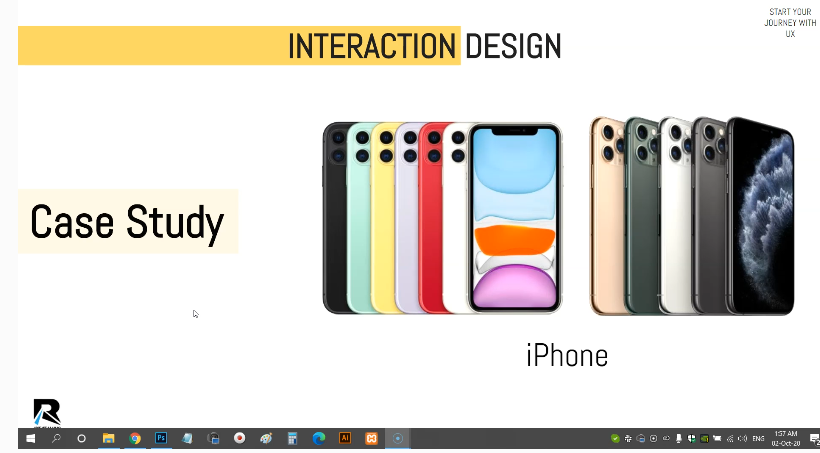

The case study is the iPhone, and the lesson is **differentiation and target audience**.

- The iPhone never placed itself among the Android phones. It did not copy Android's direction, and that separation is exactly why it holds its own audience. If iPhone had just followed Android, it would not have worked, it would be one more phone in the same crowd.
- Which phone a brand builds depends entirely on the user and the target audience. Some phones are built for gaming, some are camera-focused, some go for balanced overall use. Chinese brands pick their own different targets (usually aggressive specs for price). Every one of these is a valid strategy because each aims at a different user.
- (My addition as reasoning: this is market segmentation applied to product design. Differentiation only works when it maps to a real audience segment; being different with no audience behind it is just being weird. The iPhone's segment pays for simplicity, ecosystem, and status, so its design decisions, one model line, locked-down software, premium build, all serve that segment.)

Same logic transfers to UI/UX of websites and any product: design so that the **right** users get attracted, not just many users. The instructor's challenge question: what if your product is heavy on functionality but the aesthetics are garbage? Then the users it deserves never come, because the first impression filters them out before they ever touch the functionality. Attraction and capability have to match the same target audience.

His other example: cars. Nobody builds "a car", they build a car for a user. A sports car is designed around one target user (speed, image, two seats are fine), a family car around another (space, safety, cost). The product's whole shape follows from who it is for. Target first, design second.

#### Part 03, Product Design: the ketchup bottle

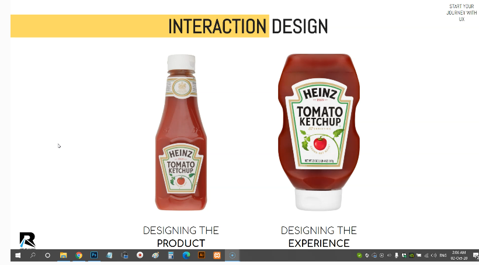

The Heinz ketchup bottles, the best two-picture summary of this whole course so far.

- **Left, designing the product:** the classic upright glass bottle. It stores sauce, it looks like a bottle "should". But sauce has to be poured onto the plate to eat, and everyone knows the real experience of that bottle: thick sauce stuck at the bottom, shaking, banging the base, waiting.
- **Right, designing the experience:** the upside-down squeeze bottle. It sits on its cap, so the sauce is always already at the opening, one squeeze and it is on the plate. Heinz learned how people actually use the product and rebuilt the packaging around that moment of use.

From a distance people might think it is made wrong, "they built it upside down", some cannot even tell what it is at first. But it was made this way exactly to make it easy for the user. That is the difference: the product is what it is, the experience is what using it feels like. The "wrong-looking" bottle gives the right experience.

The instructor turns it into an exercise for us: look at your own life and ask which things are badly designed. The door, the chair, the laptop, a box, the cell phone, anything you touch daily. Find the thing where the experience is bad, and think what change would actually help your own experience, then do that. Everyday annoyance is a UX backlog waiting to be read. (Related: this is the founding idea of Don Norman's "The Design of Everyday Things", his famous examples are doors people push when they should pull, "Norman doors". The ketchup bottle is the same lesson in a kitchen. Source: en.wikipedia.org/wiki/The_Design_of_Everyday_Things)

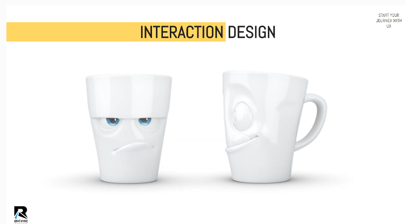

Same lesson again with the two mugs, and the slide plays it as a joke: the mug without a handle has a grumpy, crying face, the mug with a handle is smiling. Why does a mug need a handle at all? Because the cup holds hot tea or coffee, and without a handle the user's hand burns. Handle = happy user, no handle = suffering user. The faces on the mugs are also a small aesthetics lesson: the design itself interacts with the user emotionally, a product can literally look how it feels to use.

The instructor is deliberately starting with physical products, mugs, bottles, phones, and says he will move step by step into web design. The principle stays identical the whole way: **products are made by thinking about the user's need.** A handle on a mug and a well-placed button on a website are the same decision at different scales.

#### Part 04, User Attraction: physical shop vs online shop

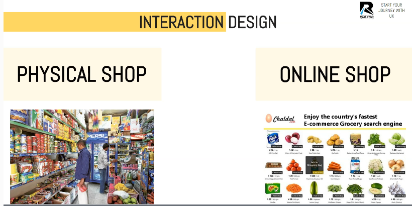

This part goes deeper, and here the course crosses from physical products into the digital world. The slide puts a Bangladeshi physical grocery shop next to Chaldal, the online grocery. Same job for the user, buying groceries, two completely different interfaces: shelves, the shopkeeper, and pointing at items on one side; a searchable grid of product cards with prices and an add-to-bag button on the other. The online shop has to recreate with design everything the physical shop does with space and people: showing what exists, telling the price, letting you pick, building trust.

In this part the instructor also talks openly about the course business itself as an attraction example: what to purchase and what not to, what he does himself, free courses versus premium courses, online classes versus physical classes. The honest point behind it: each format attracts a different user for different reasons (price, flexibility, discipline, certificates), so even selling education is a target-audience decision, the same lesson as the phones and cars.

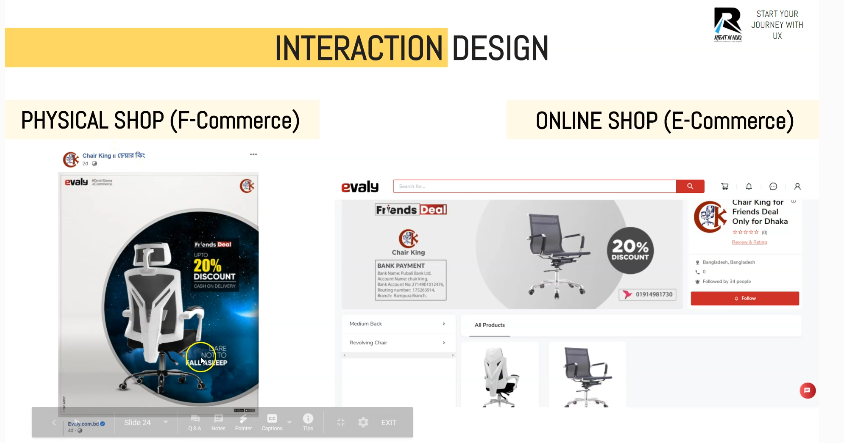

Then a very Bangladeshi pair: **physical shop turned F-Commerce vs online shop on E-Commerce**, shown with Chair King selling office chairs through Evaly. On the left, the Facebook-page style promo poster (Friends Deal, 20 percent discount, cash on delivery, bank payment details typed into the post). On the right, the same shop inside the Evaly marketplace: search bar, product grid, ratings, a Follow button, a proper store page.

Why join a marketplace at all? Because the marketplace has done the user research and holds the data. Evaly-type platforms know who buys, what they look at, what converts. Other shops come onto the marketplace exactly for that: the platform attracts the users for them, with promotions, discounts, and the whole shopping UX already built. The small shop rents the marketplace's user experience instead of building its own.

(My addition: this is also a warning example in hindsight. Evaly attracted users with deep discounts brilliantly, and later collapsed in Bangladesh's biggest e-commerce scandal, unable to deliver what it sold. Attraction UX brings users in, but the experience promise still has to be kept, otherwise the same crowd that came fast leaves faster. Source: en.wikipedia.org/wiki/Evaly)

#### Part 05, Users Accustomed

First example: the instructor's own live shows and workshops, run on Zoom and StreamYard. This is "accustomed" in action, users got used to live video as a normal way to learn and attend events, so a teacher now meets students where their habits already are. The tool follows the habit.

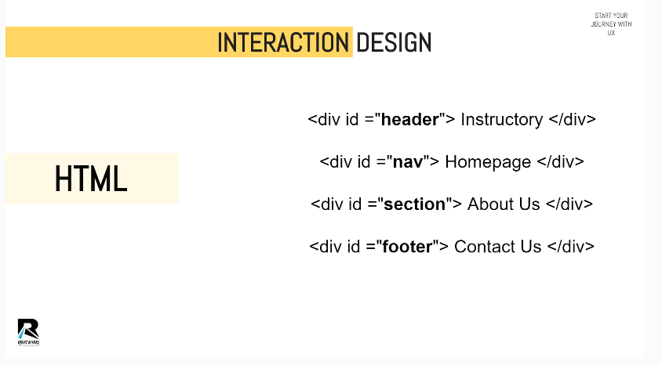
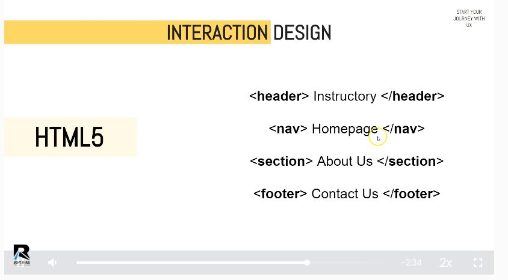

Then the best developer-facing example in the course: **HTML vs HTML5.**

- The old way: whoever wrote HTML built everything out of divs, `
`, `
`, `
`, `
`. It worked, but every page was an anonymous pile of divs and only the ids hinted at meaning.
- HTML5 turned those habits into real tags: `<header>`, `<nav>`, `<section>`, `<footer>`. The language itself adopted what coders were already accustomed to doing.

The lesson lands on two levels:

1. **Coders are users too.** HTML5's semantic tags were made for the coder's experience. The W3C looked at what developers were already naming their divs and gave them native elements for it. That is developer experience (DX), UX where the user is a programmer, and it proves "know your user" applies to languages and tools, not just apps. (Related: the HTML5 authors literally studied millions of pages to find the most common div id and class names, header, nav, footer among the top, and turned them into elements. Source: whatwg.org / en.wikipedia.org/wiki/HTML5)
2. **This is done to serve user need and attraction better.** Semantic structure makes pages easier to build right, and a correctly structured page is better for the end user too: screen readers can navigate it, search engines understand it, so the right users find and can use the site. Serving the coder's habit ends up serving the visitor's need.

For me this example ties the whole section together: "users accustomed" is so strong a force that even a language standard bent to match what its users were already doing.

#### The interaction design chain

The course frames interaction design as a chain:

1. **User need**: everything starts here. No need, no product. Find the need before designing anything.
2. **Case study**: look at how others solved the same need. Learn from existing solutions before inventing.
3. **Product design**: design the solution around the need, not around what looks cool.
4. **User attraction**: how the design pulls users in. First impressions, visual hooks, clear value.
5. **Users accustomed**: the end goal. Users build a habit around the product. When people use it without thinking, the interaction design worked.

My takeaway: attraction gets users in the door, but "accustomed" is what retention actually is. Design for the habit, not just the landing.

Closing thought for the section: there are plenty of tools for wireframing and UX work, and a lot of people jump straight into hyping Figma or Adobe XD. Tools come later. The foundation has to be strong first, the thinking in this section is the foundation, the tool is just where you express it. Next section: Human Centered Design.

### Human centered design, the DND concept (Section 6)

Human centered design (HCD) means the human is the starting point of every decision, not the technology and not the business. And DND stands for **Don Norman Door**, the section is built around one man and one door.

#### Part 01: who Don Norman is, and his door

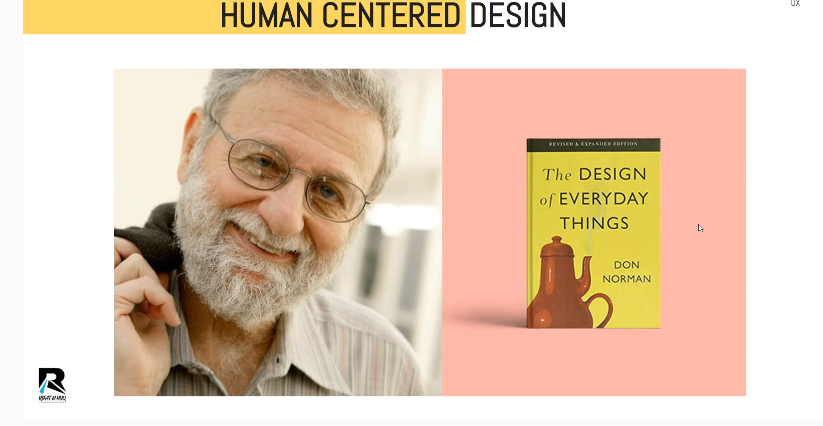

**Don Norman** is an American cognitive scientist and design researcher, the person who literally coined the term "user experience" when he worked at Apple in the 1990s, and co-founder of the Nielsen Norman Group, the consultancy whose articles I keep citing in these notes. His ideas did not stay in one country: designers and companies all over the world took his thinking and built their design practices on it, which is why a Bangladeshi UX course in 2020s teaches concepts an American professor wrote decades ago. (Source: en.wikipedia.org/wiki/Don_Norman, jnd.org)

His book **The Design of Everyday Things** is the classic of this field. The core of what he says: when people fail to use an object, the fault is almost never the person, it is the design. Everyday objects must show you how to use them by their shape alone, a well-designed thing needs no instructions. He calls these visual hints affordances: the form of the object tells your hands what to do.

#### The door examples

**The ICU door.** Picture a stretcher being rushed to the ICU. What kind of door must be there? There may be NO free person to open the door, everyone's hands are on the stretcher, and stopping costs a life. So the door has to open by being pushed through, or open automatically. This is the extreme case that proves the principle: the design must work in the user's real situation, not in an ideal one where someone is always available to hold the door.

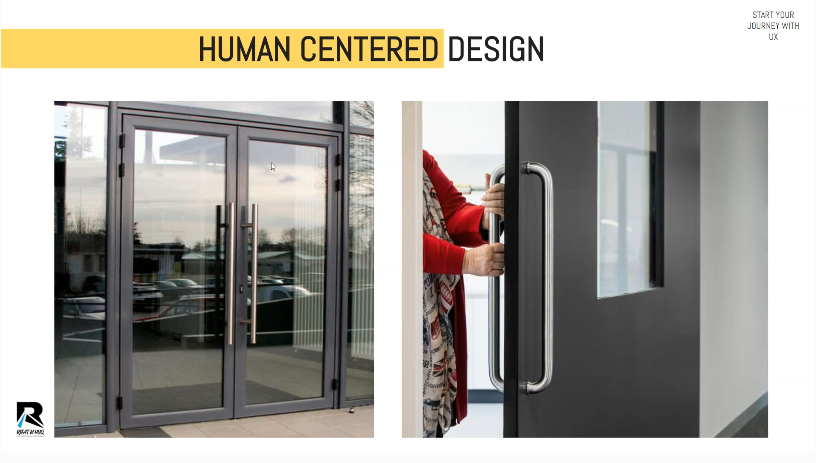
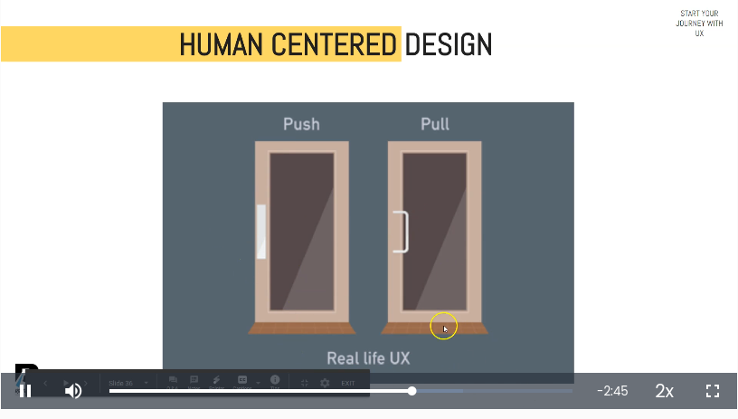

**The everyday door confusion.** You walk up to a door, do you push or pull? Often you cannot tell by looking. The rules our hands already know:

- Nothing to grab, a flat plate, you push. There is no other option, the design forces the correct action.
- A handle sticking out says grab me, so people pull.

We push and pull doors all day, and sometimes Push or Pull is written on the door. But problems still happen, and that is the famous point: **if a door needs a label, the design has already failed.** A handle that invites pulling on a door that must be pushed will beat the sticker every time, because hands read shapes faster than eyes read words. This exact confusing door is what the world now calls a "Norman door".

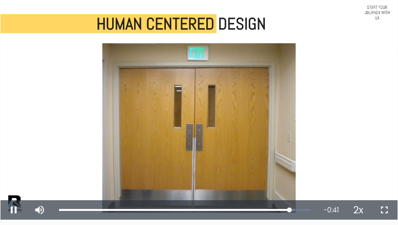

The hospital doors in the last slide do it right: flat push plates, no handles, an EXIT sign above. Nothing to grab means nobody ever pulls, and a stretcher can crash straight through.

**Getting the direction right matters too.** From inside a room heading out, the door should push open in the direction you are moving (this is also why emergency exits open outward, a panicking crowd pushes, it never pulls). So for every door: decide which side pushes and which side pulls from the user's direction of movement, give each side the hardware that matches (plate for push, handle for pull), and only then decide what, if anything, needs to be written on it. Do all of it, every time.

#### What this means for our work

When we build a website or a service for someone, we have to keep exactly these things in mind. How to keep them in mind, in practice:

- Make the design show the action. A button must look pressable, a link must look clickable, the same way a flat plate says push. If users need a tooltip to know something is clickable, that is a Norman door.
- Match the design to the user's real situation, the ICU test: assume the user is busy, one-handed, distracted, on a slow phone, and design so the main action still works.
- Labels are the last resort, not the fix. First get the shape and placement right, then add words only where they genuinely help.
- And test by watching: if people hesitate at your interface the way they hesitate at a bad door, the design failed, not the user.

#### The automatic door, and where NOT to use it

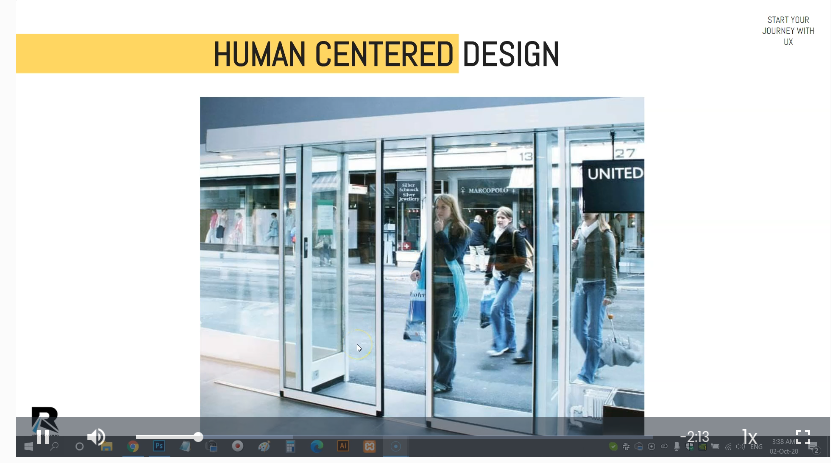

Another human centered design example: the **automatic door**. Nobody pushes, nobody pulls, the door reads your approach and opens itself, the ultimate answer to the push-pull confusion.

But here is the deeper lesson: **we cannot put this door everywhere.** A bank cannot use a wide-open automatic entrance, security comes first there, the door is supposed to slow people down and control who enters. A shopping mall, a supermarket, a hospital, an airport, those can and should use it, because their goal is the opposite: let the maximum number of people flow in with zero friction.

So the same design is right in one place and wrong in another, and the deciding factor is the context's real priority: **flow vs control.**

The website version of the same decision: think about what should be highly accessible and what should sit behind security, and when.

- The product pages, prices, search, blog: automatic door. Zero friction, no login, no popup wall, let everyone flow in.
- The checkout, the account settings, the admin panel: bank door. Deliberate friction, password, OTP, confirmation steps, because here control matters more than speed.
- And timing matters: a cart can be open to a guest (accessible now), but payment requires verification (secure when it counts). Asking for login too early is putting a bank door on a shopping mall, security in the wrong place is just lost users.

#### Innovation never stops

The instructor's next point: the world will keep producing new things like this, innovation after innovation, each one born from a human pain. His example: office chairs hurt people's backs during long sitting, so the **gaming chair** appeared, high back, neck pillow, lumbar support, built around the body of someone who sits for 8 or more hours. More of the same pattern:

- The computer mouse hurt wrists, so the vertical ergonomic mouse appeared.
- Typing on phone keyboards was slow, so swipe typing and voice input appeared.
- Carrying cash was risky and slow, so bKash and mobile wallets appeared in Bangladesh.
- Standing in queues wasted hours, so token systems and appointment apps appeared.

The formula is always: find where the human hurts, redesign around the human. There will always be a next one, which is why this field never runs out of work.

#### Watch: "It's not you. Bad doors are everywhere." (Vox)

The instructor closes with this video, and it is the best 5 minutes on this whole topic. Watch it when reading these notes:

▶️ **[It's not you. Bad doors are everywhere. — Vox and 99% Invisible, feat. Don Norman](https://www.youtube.com/watch?v=yY96hTb8WgI)** (Joe Posner, 2016, ~5 min)

📋 <b>Click to expand: what the video teaches (my summary)</b>

> 🚪 **The setup.** The video starts with people failing at a simple office door, pushing when they should pull, over and over. Everyone's instinct is "I'm so stupid". The video's whole point: **it is not you, it is the door.**
>
> 📖 **Where the idea came from.** Don Norman got so frustrated by badly designed doors, switches, and taps that he wrote "The Design of Everyday Things". Confusing doors are now literally called **Norman doors** after him.
>
> 🔑 **Two design principles he gives:**
> 1. **Discoverability**: just by looking, you should be able to discover what actions are possible. A door must announce push or pull by its shape.
> 2. **Feedback**: after you act, the thing should show what happened. You should never wonder "did that work?"
>
> ✋ **Signifiers beat signs.** A vertical grab-bar signals PULL. If that bar is mounted on a push door, people will pull forever, no matter what the sticker says. A flat plate can only be pushed, so nobody gets it wrong. The hardware is the instruction.
>
> 🎨 **Why bad doors exist.** Designers chase beauty, sleek glass doors with identical elegant handles on both sides, and beauty wins over usability. Looks pretty in photos, fails at its one job.
>
> 🔁 **The fix is human centered design:** observe real people using the thing, prototype, test, and iterate until the confusion disappears, design for how humans actually behave, not how we wish they behaved.
>
> 👁️ **The curse.** Once you learn to see Norman doors, you see them everywhere, and that noticing is the first skill of a UX designer.

My connection back to our work: every one of those principles maps one-to-one to interfaces. Discoverability = a button looks pressable. Feedback = loading states and confirmations. Signifiers over signs = shape and placement over tooltip text. The door is just the cheapest place to learn it.

### Case study: Instructory itself (Section 7)

Best section of the theory block. The instructor built Instructory (the platform the course runs on) and walks through the entire startup thinking as a UX case study:

1. **Brainstorming, business proposal, pitch deck**: UX work starts before any screen exists, at the level of what the business is.
2. **Problem and solution**: Bangladesh-context problem, students and professionals need income and skills, instructors need a platform to teach and earn. The solution is the marketplace connecting them.
3. **Context and overview of the case**: who the players are, what already exists locally, plus the company's real numbers: founded December 27, 2017, founder and CEO Rifat M Huq, headquarters Dhaka, area served Bangladesh, 15 employees, servers on Amazon and Vimeo, operations launched May 27, 2019, and by October 2020: 14,000+ total users, 10,000+ learners, 114 instructors, 20,000+ enrollments. (Slide: [s07-instructory-company-facts.png](slides/s07-instructory-company-facts.png)) One small language note the instructor mentions here: Instructory started writing everything in English, content and social media both, then switched to writing in Bangla, because Bangla connects with more of the actual user base. Speak the language your users think in, not the language that looks more professional. He mostly walks through the Instructory case study itself in this part, so I am keeping notes short here and pointing forward to the fuller breakdown in Part 02 above. One line worth keeping on its own: a company still at the idea stage, with no working product yet, targeting the whole world as its audience, is a problem. Target audience has to match the stage you are actually at, a global target with zero traction is not ambition, it is unfocus.
4. **Features and competitor analysis**: compare against Udemy-style global platforms, find the local gap (payment methods, language, pricing).
5. **Market size and target audience**: size the market before building. Target audience definition feeds directly into personas later.
6. **Business model**: how the platform earns (revenue share on courses). UX must support the model, checkout and instructor payout flows are UX problems.
7. **Current status and traction**: numbers as proof the design decisions worked.
8. **Team and gameplan**: who builds it and the 5 year plan.

Takeaway for AI Buddy work: this maps almost one-to-one to how we should present client projects. Problem, solution, competitors, market, model, traction. A design pitch is a business pitch.

### UX errors (Section 8)

This section is really about one specific, very common error: **error messages that do not tell the user the actual error.** The instructor's core rule: never show a vague, generic error. Show the exact, real reason, so the user knows what happened and what to do next.

#### Confusing vs clear error messages

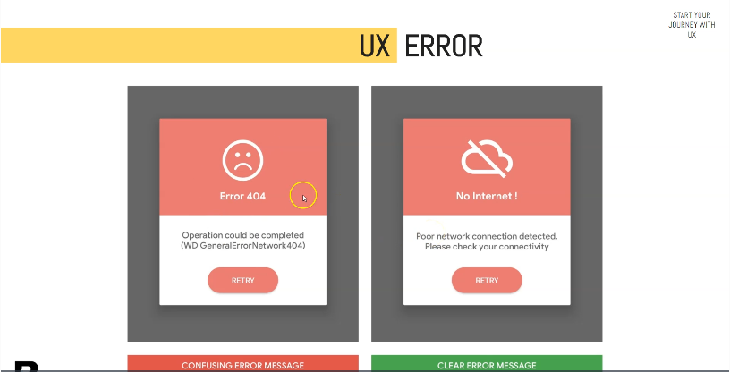

Two error cards side by side, same situation, opposite quality:

- **Confusing:** "Error 404, Operation could be completed (WD GeneralErrorNetwork404)". A sad-face icon, a Retry button, and a message that is really an internal error code dressed up as a sentence. The user has no idea what actually failed or what to do differently before clicking Retry again.
- **Clear:** "No Internet! Poor network connection detected. Please check your connectivity." Plain language, names the real cause, and tells the user exactly what to go check. Retry now makes sense as the next step, because the user knows what they are retrying after fixing.

**404 specifically is a UX trap.** A raw "404" or a generic system code is a message written for a developer reading logs, not for a user staring at a screen. If a page is missing, say "This page doesn't exist" or "This page has moved". If it's a network problem, say "No internet" or "Server not responding, try again in a moment". Match the message to the real, specific cause every time, never the generic catch-all.

#### Login failed, said two different ways

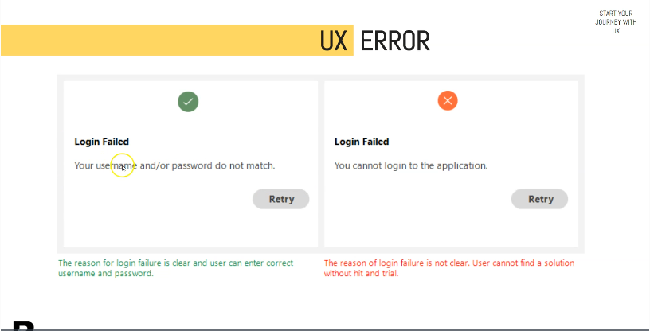

Same idea, sharpened on a login form:

- **Good, green check:** "Login Failed. Your username and/or password do not match." The reason is clear, the user immediately knows what to try next, re-check the username and password. One try usually fixes it.
- **Bad, red X:** "Login Failed. You cannot login to the application." This tells the user nothing. Is the password wrong? Is the account locked? Is the server down? The user is left to guess and hit-and-trial their way to a fix, or give up.

The instructor's rule stated directly on the slide: the reason for failure must be clear so the user can act correctly, not left guessing.

#### The general pattern, beyond just these two examples

Taking the login and 404 cases and generalizing them to every kind of error a product can throw:

- **Validation errors** (wrong format, empty required field): say exactly which field and why. "Email must include an @" beats "Invalid input".
- **Permission errors**: say what the user lacks. "You need admin access to do this" beats "Action not allowed".
- **Payment errors**: say what actually happened. "Card declined by your bank" beats "Transaction failed".
- **Server/system errors**: say it is on the product's side, not the user's, and what to do meanwhile. "Something went wrong on our end, we're on it, try again shortly" beats a stack trace or a blank white screen.
- **Timeout/network errors**: name the network, like the "No Internet" example above, instead of a generic failure code.

The underlying principle across every one of these: an error message's job is to turn a stuck user back into a moving user. A vague message leaves them stuck and guessing, a specific message gives them the one next action to take. This is the same idea as Don Norman's feedback principle from Section 6, the interface must tell the user clearly what happened, every single time, especially when something goes wrong.

### UX myths (Section 9)

#### Part 01, Need to Focus: what a website actually needs to attract someone

The myth is that pure focus and effort alone are enough, and this part shows what that actually has to translate into on a real page. Starting point: **people read on the web**, so a page cannot be images alone. It needs real, readable content that gives the visitor a reason to like and trust what they are looking at, something to actually read and connect with, not just look at.

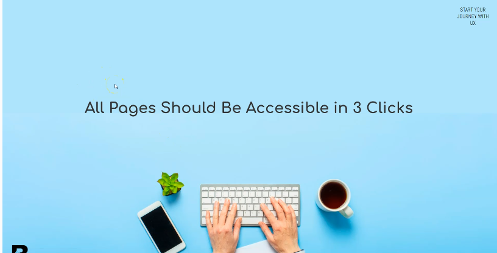

Then the concrete structural rule: **every page on the site should be reachable within 3 clicks.** The instructor's example is an online clothing shop:

1. **Click 1:** the top-level category. Men, Women, Child, Old (older/senior). This is the first split a visitor makes.
2. **Click 2:** the sub-category inside that group. Under Men, things like bracelet, shoe, watch, and so on.
3. **Click 3:** click a sub-category like Watch, and land on every watch-related product, all of them accessible from here.

From there, one more click into an individual product opens its full details page, everything about that product, and from that page the actual buy or add-to-cart action is available. The whole path (category to sub-category to product list to product details to buy) has to stay shallow, the visitor should never be hunting more than 3 clicks deep to find what they came for.

(My addition: this is the classic "3-click rule" in web usability, and while researchers later showed users will click more than 3 times if each click clearly moves them closer to their goal, the spirit of the rule still holds, every extra click needs to feel like progress, not a maze. What actually matters is that each click is obviously the right one, not the raw click count. Source: nngroup.com/articles/3-click-rule/)

Tying this back to the myth: focus alone does not make a good site. You need real content people will read (trust and connection) plus a shallow, logical navigation structure (findability). Effort without that structure just produces a focused, well-built maze.

#### Part 02, Need More Research and Thinking: why you must redesign periodically

The myth here is that once research and thinking produced a good design, the job is done forever. It is not, because the user in front of the design keeps changing, even if the product does not.

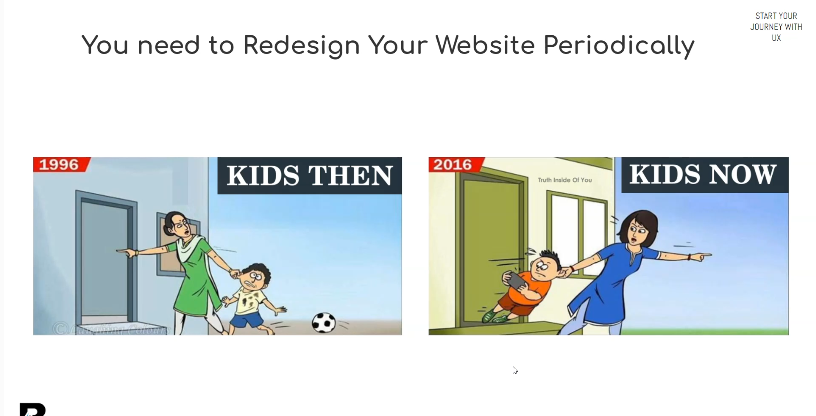

The comic makes it personal: **1996, kids then**, the mother points her son outside to go play football, ball in hand, real field. **2016, kids now**, the same scene, but the son is pulling toward the TV or a screen indoors, the mother is the one pointing him outward and he resists. My own memory matches this exactly: I used to play football outside as a kid, now play happens at home, on a phone. And by 2020, then 2026, the gap is even wider again, each few years shifts the baseline further.

This has a direct product consequence: **cricket bat and ball sales go down**, not because the game died, but because kids are not attracted to going out and playing in the field anymore, they are on mobile. If you sell sporting goods, your users' actual behavior moved even though your product did not. A shop or a website built around "kids play outside" assumptions from 2016 is now designed for a user who barely exists anymore.

So when the audience's habits shift like this, **a full redesign is needed**, not a patch. Color combination, font family, layout, all of it, because the old choices were tuned to an old kind of attention and an old kind of user, and none of that carries over automatically.

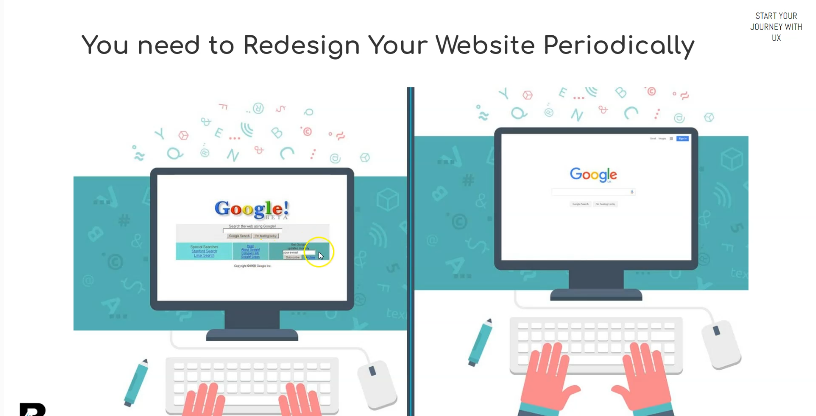

Google itself is the proof at platform scale. When Google first became the leading search engine, its homepage was dense: a full top navigation bar, a services strip, extra links and text crowded around the search box. Step by step, across the years, Google stripped it down to what it is now: a logo, one search box, almost nothing else. The whole industry's sense of "how much can we ask a user to look at" changed, from Internet Explorer-era pages packed with menus and banners to today's expectation of a clean, single-purpose screen. Google's redesigns were not decoration, they tracked how users' patience and screen habits evolved.

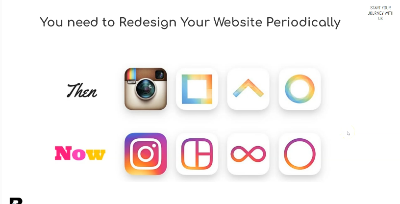

Even a logo is not exempt. Instagram's old app icon (2010 to 2016) was a literal retro camera illustration, brown, detailed, skeuomorphic. It matched the design taste of its era. The current icon is a flat gradient outline of a camera, simple enough to read at a tiny size on a modern high-density phone screen, and matching the flat, bold visual language every other major app moved to. Same brand, same purpose, completely different visual language, because the devices, screen sizes, and the surrounding design taste of the whole industry had moved on.

(My addition, tying all three examples together: this is the underlying reason UX and UI are never "finished". Users age, habits shift, competing products reset expectations, and screens themselves change (bigger phones, higher density, dark mode). A design that was excellent research five years ago can be actively wrong today, not because it got worse, but because the user in front of it changed. Periodic redesign is not chasing trends for their own sake, it is re-doing the research and thinking part of UX on a schedule, because "know your user" is a snapshot that expires.)

**Client work note:** this applies directly when working for a client too. Part of the job is proactively suggesting a redesign, even a small one, when it will genuinely make the client's users happier, colors, layout, freshness, not waiting for them to ask. A client is happy when their product still feels current to their own users.

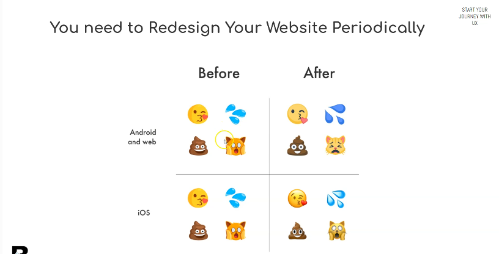

One more layer of the same idea, at the smallest possible scale: emoji icons themselves get redesigned. The slide compares Android and web emoji against iOS emoji, before and after a redesign pass, same four emoji (kiss face, water splash, pile of poop, screaming cat face) redrawn to look more realistic, more detailed shading, more expressive faces, smoother shapes. Even something as tiny as an emoji is not fixed forever, platforms keep refining them to look better and communicate more clearly as rendering technology and screen quality improve.

Why does this keep happening at every scale, from a whole homepage down to a single emoji? A few reasons together:

- **Realism and technical capability grow.** Higher resolution screens and better rendering let designers add detail that would have looked broken on older, lower-quality displays.
- **Smoothness and clarity improve.** Redesigns usually simplify shapes even while adding polish, easier to read at a glance, especially at small sizes, which matters more as icons appear across more device sizes.
- **The whole platform's visual language shifts**, and everything on it gets pulled along so it still feels like one consistent product (this connects back to the UX principle of Coordination and Consistency in Section 10).

**But there is a real cost the instructor is honest about: users get bored of change, and some genuinely resist it.** People get used to how something looks and works, and change breaks that comfort even when the change is objectively better. You will hear people say "the old one was better" purely out of habit, not because the redesign failed. Facebook is the textbook example: every time Facebook changes its look, a wave of people complain, some go as far as writing angry, insulting posts about the update, cursing the new layout in their own status. Yet Facebook keeps redesigning anyway, because the alternative, freezing the product in an old visual language forever, loses far more users over time than a redesign backlash costs in the short term.

So the UX myth hiding inside "need more research and thinking" is really this: research and thinking are not a one-time investment that lasts forever, they have to include planning for resistance to change itself, how do you introduce a redesign so people adopt it instead of just complaining about it. The instructor says this exact question, how users come to accept a redesign despite that resistance, is covered in the next lesson, so I will pick this up there.

#### Part 03, Need More Concentration: the Facebook redesign story

This part continues straight from Part 02's Facebook example, and walks through how Facebook itself evolved, as real proof of everything just discussed.

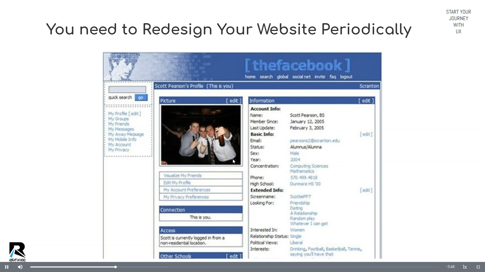

**2005, "[thefacebook]".** Look at this screenshot properly: a dense two-column profile page, a top bar with plain text links (home, search, global, invite, faq, logout), a sidebar list of "My Profile / My Groups / My Friends / My Messages / My Away Message / My Mobile Info", and a huge information block with fields like Screenname, Looking For (Friendship, Dating, A Relationship, Random play), Interested In, Political Views. This was built for a small, closed audience, college students on a specific campus network, who wanted a dense personal profile page, closer to a dating-site bio than a feed. Notice there is no feed at all here, you land straight on a profile.

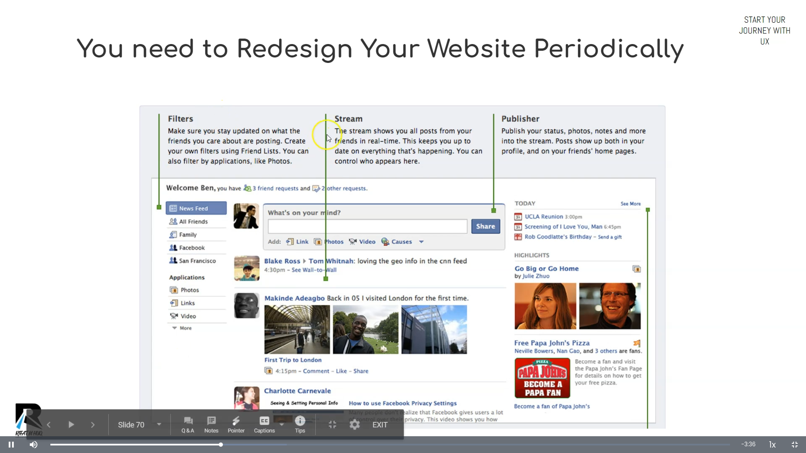

**A couple of years later, the News Feed arrives**, and this is the actual redesign moment the instructor is walking through. The new layout is explained in three labeled parts right on the slide:

- **Filters**, left side: friend lists, applications, ways to control whose posts you see.
- **Stream**, center: all your friends' posts in real time, the thing we now just call "the feed".
- **Publisher**, top of the stream: the "What's on your mind?" box to post a status, photo, video, or link, the direct ancestor of every "create post" box on every platform today.

**When News Feed launched, a lot of users took it very lightly at first**, then reacted strongly once they understood what it actually meant: every action was now visible to your whole friend list automatically, not just to someone who chose to visit your profile. People suddenly felt watched. This was Facebook's first big redesign backlash, protest groups against News Feed exploded within days of launch. But the feed is exactly the format Facebook (and every social platform after it) kept building on, because it solved a real problem: nobody wants to manually visit 200 friends' profiles one by one to see what happened, a single scrollable stream does that job for you.

**What changed concretely, moving from profile-only to feed-based, and onward from there:**

- From a static profile as the destination, to a scrollable feed as the home you land on every time.
- Photos and video went from a separate "Picture, edit" box to first-class post types directly inside the Publisher and the Stream.
- Plain text navigation links became icon-based navigation (this connects straight back to the icon realism example from Part 02, plain text menu items eventually became recognizable icons for News Feed, Friends, Groups, Video).
- **Tooltips appeared.** As the interface added more icons and less text, tooltips (the small hover/tap hint that names an icon) became necessary so users could still tell what an unlabeled icon does, this is a direct consequence of moving from text-heavy 2005 to icon-heavy modern design, you gain visual cleanliness but you owe the user a hint back.
- The look kept getting smoother overall: better typography, more whitespace, softer visual weight, matching Part 02's Instagram-logo point about the whole industry's design taste moving together.

**And when someone leaves the News Feed for another part of the site and comes back, or leaves the site and returns after a break, they now expect the feed to have moved on without them,** new posts waiting, exactly like scrolling back into a live stream. That expectation itself, "the feed keeps going while I'm away", did not exist in the 2005 static-profile world, it is a behavior News Feed itself trained into users.

**Closing thread for this whole myth (Section 9), and how it hands off to the next lesson:** the instructor says we will see more real-life examples of this UX myth, and more importantly, look at how much a redesign attracts users and how they come to accept it, in the next lesson. So the open question carried forward is exactly the one from Part 02: research and thinking are not finished once, they also have to include how you roll out change so people adopt it instead of resisting it, which is Part 04, coming next.

*(Slide capture note: the modern Facebook UI screenshot for this part did not save to disk before the recording tool moved on, so it is described in text only below. Re-send it if you want it embedded.)*

**Continuing straight on: modern Facebook.** The slide showed today's Facebook homepage: a top bar with icon-only navigation (Home, Watch, Marketplace, Groups, Gaming), Messenger/Notifications/Profile icons on the top right, a left sidebar (Home, Create, your profile, groups like "Red Table Talk Group", Events, Saved, Pages, Friends, Settings and Privacy, See More), a center feed with a Stories row at the top, the "What's on your mind" composer with Photo/Video, Tag Friends, Feeling/Activity options, and a right sidebar for Sponsored posts, Birthdays, and Contacts. Compared with the 2005 and 2007 screenshots from Part 03, this is the same core idea (profile, feed, publisher, friends) but every part has been through several more redesign passes since.

**The part I found most important here: today's Facebook is missing a lot of features it used to have, on purpose.** Old things got cut, not because nobody used them, but because most people did not, or because they hurt the experience for the majority. Instead of removing them for everyone outright, Facebook does staged testing: some users get switched to a simplified "Basic" version, some users keep a feature others do not have at all, and the company watches what happens before deciding for good.

**This is Facebook literally doing MVP and A/B testing at their own giant scale**, the same methods from the course's Section 18 (MVP) and Section 19 (Agile and A/B) sections, just applied continuously instead of once:

- Ship a change to a slice of users only, not everyone at once.
- Watch real behavior: does engagement go up or down, do people complain, do they adapt.
- Keep it, tune it, or roll it back based on that real data, not on opinion.
- Only after it proves out do they roll it out wider, sometimes permanently, sometimes it quietly disappears again.

(My addition: this is the same logic as the "switch to basic" and "keep some users on old feature sets" behavior you'll notice on many big platforms, staged rollouts, feature flags, percentage-based experiments. It is the practical proof that "redesign" is never a single big-bang event for a mature product, it is a constant stream of small, tested MVPs. A platform the size of Facebook cannot afford to guess at global scale, so every real change is first tried small.)

#### Part 04, Need More Creative Thinking: what COVID forced everyone to redesign

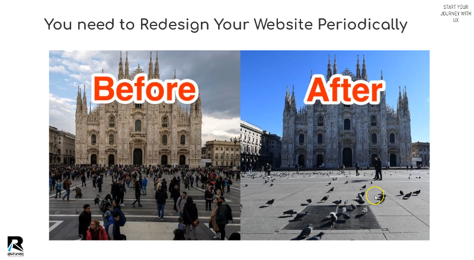

The slide is a before-and-after of a crowded public square, packed with people versus nearly empty, and the instructor uses it as the visual shorthand for what the COVID-19 pandemic did to the world overnight. This part is the sharpest possible proof of the whole redesign myth: sometimes you do not get years to gradually evolve like Facebook did, the world itself changes in weeks and every product has to catch up immediately or become useless.

**Before COVID: physical meetings, physical classes, physical everything.** After COVID: Zoom, and video calls in general, became the default for meetings, classes, weddings, doctor visits, everything that used to require a room. A tool that was a niche business product suddenly had to serve hundreds of millions of brand new, non-technical users overnight, students, teachers, grandparents, everyone.

**What we should learn from this, tying back to the whole Section 9 theme:** a redesign is not always a slow, planned choice. Sometimes the world changes the user's context violently and fast, and the product's job is to catch up to that new context immediately, or lose the users entirely to whoever adapts faster.

**What actually happened to Zoom, checked against real sources rather than just memory, since you asked me to always verify:**

- Zoom's daily meeting participants went from about 10 million in December 2019 to roughly 300 million by April 2020, an almost unimaginable, sudden scale jump.
- That sudden scale exposed real problems fast, exactly the "negative feedback matters too" point: **"Zoombombing"**, uninvited strangers joining meetings and posting hate speech, pornographic images, or threats, because meetings were too easy to guess into. **Real user privacy leaks**, Zoom's iOS app was found sending user data to Facebook, even for users without a Facebook account, without disclosing this properly in its privacy policy. And **overstated encryption claims**, Zoom marketed "end-to-end encryption" that was not actually end-to-end at the time. (Source: [Tom's Guide, "Zoom security issues: what's gone wrong and what's been fixed"](https://www.tomsguide.com/news/zoom-security-privacy-woes); this data-sharing issue also drew a class-action lawsuit, [SFist coverage](https://sfist.com/2020/04/01/zoom-video-conferencing-hit-with-privacy-scandal/))
- **Zoom's response is the redesign lesson:** they froze all new feature development for 90 days and put every engineer on fixing privacy and security instead. Concrete changes that shipped from that freeze: passwords required on meetings by default, the Waiting Room feature so a host approves who enters, host controls to mute participants or lock screen sharing, a "Report a User" button, and eventually a real, optional end-to-end encryption mode. (Source: [Reco, "Zoom Privacy Issues"](https://www.reco.ai/hub/zoom-privacy-issues); [PMC, "Why Zoom Is Not Doomed Yet: Privacy and Security Crisis Response in the COVID-19 Pandemic"](https://pmc.ncbi.nlm.nih.gov/articles/PMC9974380/)) An $85 million class-action settlement followed the Facebook data-sharing and Zoombombing issues.

**The point you raised is exactly right and worth keeping as its own rule: both negative and positive feedback matter, and negative feedback especially cannot be ignored just because growth looks good.** Zoom's user count exploding was the positive signal, but "users are saying their info is leaking through this app" was the negative signal that actually forced the real redesign. A team that only watches growth numbers and ignores complaints like that would have kept the leak open while celebrating the download chart. Listening to what users say is going wrong, not just counting how many are using it, is what turns a crisis into a fixed product instead of a dead one.

1. **"Need to focus"**: focus alone is not enough.
2. **"Need more research and thinking"**: research alone is not enough either.
3. **"Need more concentration"**: same.
4. **"Need more creative thinking"**: creativity without user grounding is decoration.
5. **"Need to design based on user demand"**: even this is a myth when taken alone, because users cannot always articulate what they need (the classic faster-horses problem).

#### Part 05, Need to Design Based on User Demand

**Why the homepage is your most important page.**

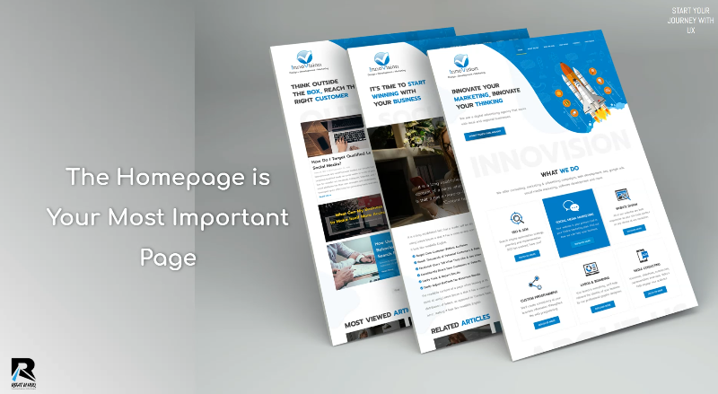

The slide shows a fanned-out set of website pages, InnoVision's homepage on top with a rocket launching, headline "Innovate Your Marketing, Innovate Your Thinking", a clean "What We Do" service grid below it, and behind it two more content-style pages with blog-post cards and "Most Viewed Articles". The homepage sits physically on top in the image because that is exactly its job on a real site: it is the page almost everyone lands on first, whether they arrive from a search result, an ad, or just typing the domain. If the homepage does not immediately look trustworthy and make it obvious what the business does and where to go next, the visitor never even reaches the good content sitting behind it, the blog posts, the service pages, the case studies, none of it matters if the front door fails. That is why so much design effort concentrates there specifically, it is the page carrying the most first-impression weight of the entire site.

**Aesthetics are not important if you have good usability.**

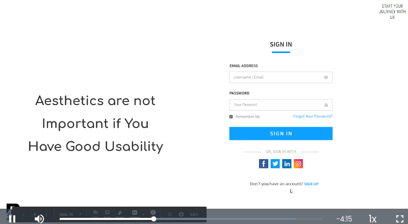

The next two slides deliberately use plain, undecorated screens to make the point stronger, no gradients, no flashy graphics, on purpose. First example, a sign-in form: Email Address field, Password field with a "Remember Me" checkbox and "Forgot Your Password?" link, one clear blue Sign In button, then social sign-in options (Facebook, Twitter, LinkedIn, Instagram), and a "Don't have an account? Sign Up" line at the bottom. Nothing about this screen is visually exciting. But usability-wise it does everything right: every field is clearly labeled, the primary action (Sign In) is the single most visually dominant element on the page, secondary paths (forgot password, sign up, social login) are present but do not compete with the primary action, and the layout follows the exact order a user's brain expects, email, then password, then submit.

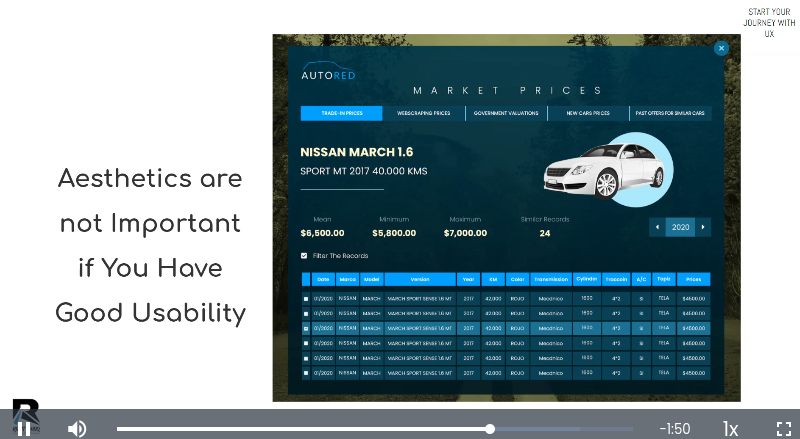

Second example, a car-pricing lookup tool (AutoRed): a specific car, "Nissan March 1.6, Sport MT 2017, 40,000 kms" is shown with its Mean, Minimum, and Maximum market price plus a count of similar records, and below that a full sortable table of comparable listings with date, model, year, kilometers, color, transmission, and price. Again, visually plain, dark and functional rather than beautiful, but it does the actual job perfectly: it answers the exact question a used-car buyer or seller has ("what is this car actually worth right now, based on real comparable data") clearly and completely, with filters to narrow the records further.

Both examples make the same case: a design does not have to be beautiful to be good UX. If a user can complete their task quickly, correctly, and without confusion, form fields make sense, data is organized, the next step is obvious, that usability alone earns trust and satisfaction, even with zero visual polish. This is not an argument against making things beautiful (Section 3 already established that UI and aesthetics matter and attract the right users), it is a corrective against believing beauty alone can substitute for a working, usable structure. **The myth being corrected here is subtle: it is not that user demand does not matter, it is that "user demand" quietly gets translated by designers into "what looks impressive to me", when what users actually demand, almost every time, is simply "let me finish what I came here to do, quickly and without friction".**

**How this applies principles from earlier in the course, put together:** the homepage point is Hierarchy and Attraction (Sections 5 and 10) at the scale of the whole site, put your best, clearest first impression where the traffic actually lands. The usability examples are Clarity and Simplicity plus Familiarity (Section 10): a labeled input field and a blue "Sign In" button need no explanation because every user has seen that exact pattern hundreds of times before, familiarity itself is what makes the plain design feel effortless rather than boring. Good UX design is not choosing beauty or usability, it is knowing which one a specific page actually needs more of, and never skipping the usability half just because the aesthetics half is more fun to work on.

The pattern behind all five: no single ingredient makes good UX. It is the combination of research, focus, creativity, and user input, checked against real behavior through testing.

### UX principles (Section 10)

The core checklist of the course. Eight principles:

1. **Know your user**: user need, user research. Everything else builds on this.
2. **Useful, credible, authentic information**: content must be true and trustworthy, trust is a UX feature.
3. **Easy to use, easy to find, accessible**: if users cannot find it, it does not exist. Accessibility is part of usability, not an add-on.
4. **Hierarchy**: visual and information hierarchy guide the eye. Most important thing biggest and first.
5. **Clarity and simplicity**: ignore complex design. If a simpler version communicates the same, the simpler version wins.
6. **Coordination and consistency**: elements look and behave the same across the product. Consistency reduces learning cost.
7. **Familiarity**: use patterns users already know. A cart icon means cart. Innovation in the wrong place is friction.
8. **Confirmation**: for destructive or important actions, confirm. Users make mistakes, good UX makes mistakes cheap.

These eight are the part I expect to reuse weekly in frontend work. Hierarchy, consistency, familiarity, and confirmation are directly implementable in code without any designer involved.

### Who can learn UI/UX, prerequisites, next courses (Sections 11 to 13)

Anyone can start, no design background required. The course positions itself as course 1 of the instructor's track (next is the UI Design course, which is my course 2). Bonus lessons get added over time.

---

## Block 2: UX methods and process

This block is the toolbox. One method per section.

### KWHL (Section 14)

A structured way to start any project:

- **K**: what do we Know already
- **W**: what do we Want to find out
- **H**: How will we find it (research methods)
- **L**: what did we Learn (filled after research)

Simple table, forces the team to admit what is assumption vs knowledge before designing. I want to try this on the next AI Buddy client kickoff.

### User Persona (Section 15, 2 parts)

A fictional but research-based profile of a target user: name, age, context, goals, frustrations, tech comfort. Personas keep the team designing for "Rina, 24, student, uses bKash on a budget Android phone" instead of "the user", which quietly becomes "me".

Rule I noted: personas come from research data, not imagination. An invented persona is worse than none because it gives false confidence.

### Site Map (Section 16)

The page hierarchy of the whole product drawn as a tree before any page is designed. Shows navigation depth, orphan pages, and duplicate paths. Cheap to fix here, expensive to fix after build.

### POEMS (Section 17)

Observation framework for field research:

- **P**: People
- **O**: Objects
- **E**: Environments
- **M**: Messages
- **S**: Services

When observing users in context, log what you see under these five headings. Turns vague observation into structured data.

### MVP (Section 18, 2 parts)

Minimum Viable Product. Build the smallest version that tests the core value hypothesis with real users. Key correction to how I used to think about it: MVP is not "a bad version of the product", it is the fastest honest test of whether the need is real. The skateboard-then-bike-then-car idea, each stage is usable on its own.

### Agile and A/B testing (Section 19)

- **Agile**: design in short cycles, ship, learn, adjust. UX fits inside sprints, research feeds the next cycle.
- **A/B testing**: two versions live, real users split between them, data decides. Opinions end where A/B data begins.

### Usability Testing (Section 20, 2 parts)

Watch real users try to complete real tasks on the product, without helping them. Even 5 users find most of the big problems. Notes:

- Test the task, not the user. If they fail, the design failed.
- Do not explain the interface first, the interface must explain itself.
- Record what they do, not what they say they would do.

### UX Laws (Section 21)

Three (well, four) named laws:

- **Fitts's Law**: the time to hit a target depends on its size and distance. Big, close buttons are fast. Practical: touch targets big enough, primary action nearest the thumb.
- **Hick's Law**: more choices, slower decisions. Cut options, group the rest. Practical: shorter menus, fewer form fields per screen (one screen per question, which is exactly the survey UX style I already prefer).
- **Jakob's Law**: users spend most of their time on other sites, so they expect your site to work like the ones they know. Matches the Familiarity principle from Section 10.
- **Miller's Law**: people hold about 7 plus or minus 2 items in working memory. Chunk information, do not make users remember.

### UX perspective of the user (Section 22, 3 parts)

Seeing the product through the user's eyes instead of the builder's. The builder knows where everything is and why, the user knows nothing and cares only about their goal. Every review of my own work should start with forgetting what I know.

---

## Block 3: Adobe XD hands-on (Sections 24 to 30)

The practical half of the course hours. Notes are shorter here because this block is learn-by-doing.

### Tool basics (Sections 24 to 29)

- XD overview, install, plans, and the artboard concept per device (mobile, tablet, desktop sizes).
- Interface and basic tools, shapes, text, pen.
- Export and import between XD, Photoshop, Illustrator, and image formats. Save to cloud vs local.
- **Libraries and UI kits**: reusable component libraries and prebuilt kits. This is the design-side equivalent of a component library in code, same DRY idea.
- **Document assets**: shared colors and character (text) styles across the file, the design-side design-tokens concept.

### Project: freelancing website (Section 30, 19 lessons, ~10 hours)

One full client-style project, a multi-page service website (repair and maintenance service business), from brief to clickable prototype:

1. Requirement analysis from a freelance-style brief.
2. Grid system setup.
3. Plugins and repeat grid for fast repeating content, image tracing.
4. Components and prototyping, layers and grouping.
5. Hero section with video, hover states, tooltips.
6. Auto-animate, MP4 to GIF, client testimonial sections.
7. Multi-page prototype: FAQ with accordion, contact page, testimonial page, special offer page, service pages, appointment booking form, footer, inserted URLs.

Takeaway as a developer: the XD workflow (components, shared assets, grids, prototype links) maps directly onto how I structure React components, tokens, and routing. Reading a designer's XD or Figma file should now feel like reading a component tree. Note: the industry has largely moved to Figma (course 3 covers it), but the concepts transfer one-to-one.

---

## My overall takeaways from course 1

1. UX starts at the business level, not the screen level. The Instructory case study proved a pitch deck is a UX document.
2. The 8 principles (Section 10) plus the 4 laws (Section 21) are a practical review checklist I can apply to any frontend PR without needing a designer.
3. Research before design, always. The myths section exists because everyone (including me) wants to skip to drawing screens.
4. "Users accustomed" reframed retention for me: the goal is habit, not just attraction.
5. One screen per question, big touch targets, fewer choices: the laws confirmed patterns I already use in survey work, now I know why they work.

Next: course 2, Start Your Journey with UI Design, applying these UX foundations to visual design.
